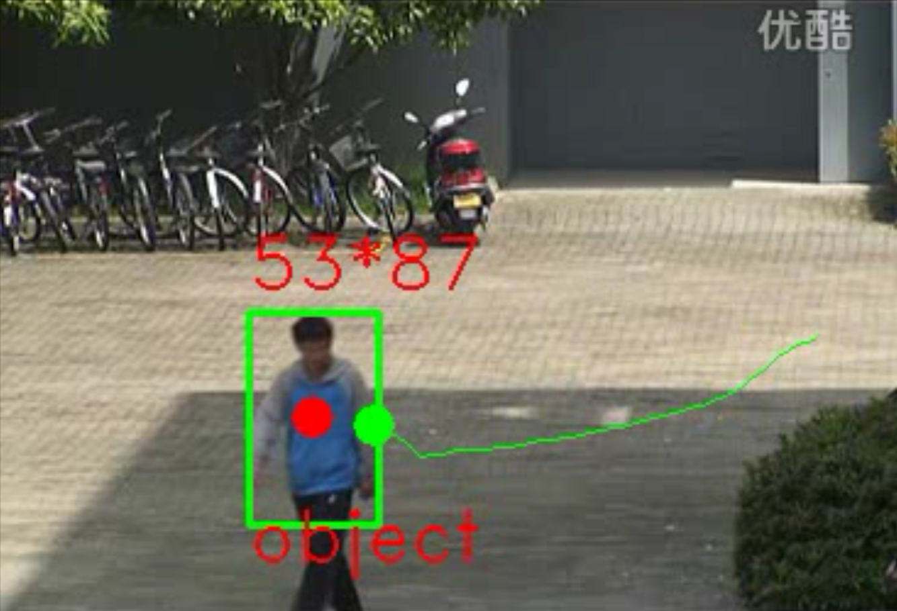

# gmm-sort
## Background Modeling and Single Object Tracking
### 基于opencv实现gmm+sort
> 在下述位置设置需要测试的视频，及保存视频路径，名称

1. git clone https://github.com/ywysf120806/gmm-sort.git
2. cd gmm-sort
3. mkdir build 
4. cmake ..
5. make
6. ./gmm_sort

> 测试结果图示：

